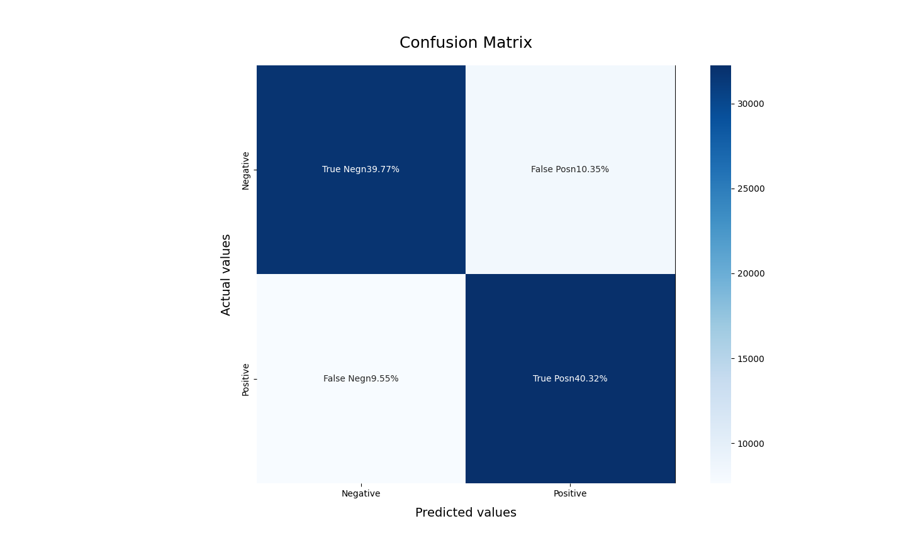

# Overview

Build a machine learning model for sentimental analysis using Twitter data.


- [Medium story](https://medium.com/@kuriko-iwai/88bb17583358?source=friends_link&sk=122d74d93dbacd7906330184b1254b80)

- Dataframe

<p align="center">
    
</p>


## Usage
1. Download [sample dataset](https://www.kaggle.com/datasets/kazanova/sentiment140?resource=download) using [kagglehub](https://github.com/Kaggle/kagglehub)

2. Pre-process the text data:
    - **Lowercasing**: Convert all text to lowercase for consistency.
    - **Stop word removal**: Eliminate common words like "the," "a," and "is" that don't contribute to sentiment analysis.
    - **Punctuation mark removal**: Remove punctuation marks like commas, periods, and exclamation points.
    - **Stemming**: Reducing the word to its base form of the derived stem
    - **Lemmatizing**: Reducing the word to its root form (lemma)


3. Build and train a model using `Bernoulli Naive Bayes Classifier`.

4. Visualize the result.

5. Evaluate the performance using `accuracy score`, `confusion matrix`, and `ROC-AUC curve`.


## Setup
1. Install dependencies
    ```
    pip shell
    pip install -r requirements.txt
    ```

2. Run the app
    ```
    pipenv shell
    python main.py
    ```


## Results
<p align="center">
    
     &nbsp; &nbsp; &nbsp; &nbsp;
    
</p>